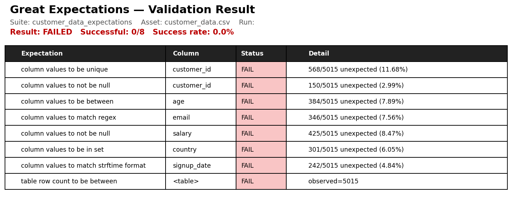
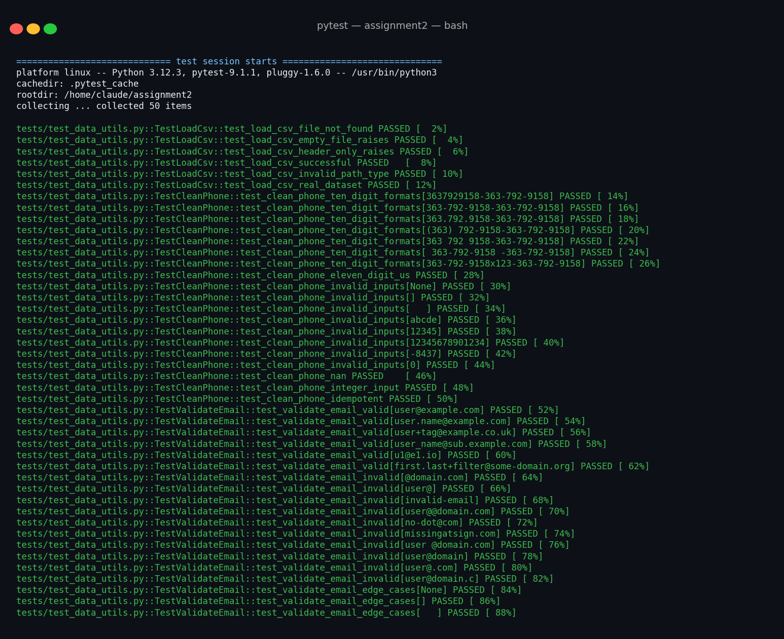

# Assignment 2 Report — Data Validation & Testing

**Course:** MAI 201 MLOps

**Author:** Peter Bello

**Tooling:** Great Expectations 1.18.2, pytest 9.1.1, Python 3.12

---

## 1. Overview

This assignment validates a deliberately messy customer dataset (`customer_data.csv`, 5,015 rows) using a `customer_data_expectations` suite in Great Expectations, and exercises three data-utility functions (`load_csv`, `clean_phone`, `validate_email`) with pytest. No model training is involved; the focus is on data-quality gates that would precede a model-retraining pipeline.

The full pipeline is reproduced by:

```bash
python setup_ge.py     # creates suite, runs checkpoint, builds HTML docs
pytest -v              # runs the unit test suite
```

---

## 2. Great Expectations validation results

The suite contains all eight expectations required by the brief. Every expectation failed against the messy dataset — which is precisely the outcome a data-validation gate should produce on input data of this quality.



> The Great Expectations HTML Data Docs site is generated at
> `gx/uncommitted/data_docs/local_site/index.html`.
> A copy of the landing page is also kept at `docs/ge_data_docs_index.html`.

Suite summary:

| # | Expectation | Column | Status | Unexpected / Total | % |
|---|---|---|---|---|---|
| 1 | `expect_column_values_to_be_unique` | `customer_id` | ❌ FAIL | 568 / 5,015 | 11.68% |
| 2 | `expect_column_values_to_not_be_null` | `customer_id` | ❌ FAIL | 150 / 5,015 | 2.99% |
| 3 | `expect_column_values_to_be_between` (0, 120) | `age` | ❌ FAIL | 384 / 5,015 | 7.89% |
| 4 | `expect_column_values_to_match_regex` | `email` | ❌ FAIL | 346 / 5,015 | 7.56% |
| 5 | `expect_column_values_to_not_be_null` (`mostly=0.95`) | `salary` | ❌ FAIL | 425 / 5,015 (91.53% present) | 8.47% |
| 6 | `expect_column_values_to_be_in_set` (USA/Canada/UK/Australia) | `country` | ❌ FAIL | 301 / 5,015 | 6.05% |
| 7 | `expect_column_values_to_match_strftime_format` (`%m/%d/%Y`) | `signup_date` | ❌ FAIL | 242 / 5,015 | 4.84% |
| 8 | `expect_table_row_count_to_be_between` (500, 1000) | *(table)* | ❌ FAIL | observed: 5,015 | — |

**Overall: 0/8 expectations passed (0.0% success rate).**

---

## 3. Data quality issues found

Counts computed by `dq_report.py` and cross-checked against Great Expectations:

### 3.1 Missing values

| Column | Nulls | % of rows |
|---|---:|---:|
| `customer_id` | 150 | 2.99% |
| `age` | 147 | 2.93% |
| `email` | 438 | 8.73% |
| `salary` | 425 | 8.47% |
| `country` | 41 | 0.82% |
| `phone` | 319 | 6.36% |
| `signup_date` | 14 | 0.28% |

### 3.2 Duplicates

| Issue | Count |
|---|---:|
| `customer_id` duplicate occurrences (excluding first instance) | 452 |
| Rows that share a duplicated `customer_id` (including originals) | 718 |
| Fully duplicate rows (all 7 columns identical) | 15 |

### 3.3 Out-of-range values

| Issue | Count |
|---|---:|
| `age` > 120 (incl. sentinel values like 500, 999) | 185 |
| `age` < 0 (incl. -25, -999) | 199 |
| `age` outside [0, 120] (total) | **384** |
| `salary` negative | 159 |

### 3.4 Format / domain violations

| Issue | Count |
|---|---:|
| Invalid email format (present but malformed: `@domain.com`, `invalid-email`, `user@@domain.com`, `no-dot@com`, `missingatsign.com`, `user@`, …) | 346 |
| `country` not in {USA, Canada, UK, Australia} (observed extras: Germany, Spain, Mexico, India, Brazil, China, France, **InvalidCountry**) | 301 |
| `signup_date` not parseable as `%m/%d/%Y` | 242 |

### 3.5 Phone-number format inconsistency

The `phone` column is technically present in 4,696 rows but uses at least six visibly different formats. Examples observed:

```
3637929158             423.366.4508
719-808-4765           (318) 414-9221
733 274 6639           -8437              <-- garbage value
```

This isn't catchable by a regex expectation alone (the assignment treats it as a cleaning task) — `clean_phone` normalises it to `XXX-XXX-XXXX` for downstream consumers.

### 3.6 Table size

The dataset contains **5,015 rows**, well outside the expected `[500, 1000]` window. Either the upstream extract pulled too much data or the expectation window needs to be revised; both are signals worth a pipeline halt.

### Total issues summary

| Category | Count |
|---|---:|
| Missing values (any column) | 1,534 |
| Duplicate customer_id occurrences | 452 |
| Fully duplicate rows | 15 |
| Out-of-range `age` | 384 |
| Negative `salary` | 159 |
| Invalid `email` format | 346 |
| Invalid `country` | 301 |
| Invalid `signup_date` format | 242 |
| Row-count out of bounds | 1 (table-level) |

---

## 4. Pytest unit test results

Three utility functions live in `src/data_utils.py`:

- `load_csv(filepath)` — loads a CSV; raises `FileNotFoundError` on missing files, `ValueError` on empty/header-only files.
- `clean_phone(phone)` — strips non-digits and normalises 10-digit US phones to `XXX-XXX-XXXX` (and 11-digit `1…` numbers to `+1-XXX-XXX-XXXX`); returns `None` for anything that can't be canonicalised.
- `validate_email(email)` — returns a boolean using the same regex used by the Great Expectations suite.

The test file `tests/test_data_utils.py` contains **50 tests** organised into three classes, one per function, covering happy paths, failure paths, and edge cases (`None`, `NaN`, empty strings, wrong types, wrong digit counts, idempotence, real-file smoke test).



Test breakdown:

| Function | Test class | Tests |
|---|---|---:|
| `load_csv` | `TestLoadCsv` | 6 |
| `clean_phone` | `TestCleanPhone` | 18 |
| `validate_email` | `TestValidateEmail` | 26 |
| **Total** | | **50 — all passing** |

Run locally with `pytest -v`.

---

## 5. Reflection — which DQ issue would most hurt model performance?

**Out-of-range `age` values would most damage an ML model**, more than any of the other issues found, for three converging reasons.

**It's the issue most likely to silently survive into training.** Nulls in `salary` are loud (95% of pipelines have a null-imputation step that flags them; many model libraries refuse to fit with NaNs). Invalid emails and weird country strings are categorical — most pipelines either explicitly fail-closed on unseen categories or bucket them into "unknown". But an `age` of 999 or -25 is still a perfectly valid float; it will pass schema checks, get fed into the optimizer, and never raise an exception. A bad `age` is the classic silent contaminant.

**Numeric outliers warp the model itself, not just one prediction.** With 384 of 5,015 rows (7.9%) holding sentinel values like 999 and -999, the mean of `age` shifts by tens of years and its standard deviation explodes (the dataset's actual std is ~104, vs. roughly 18 for a realistic population). For any model that standardises inputs (logistic regression, neural networks, kNN, k-means), this means *every* row's `age` feature is squashed into a tiny band around zero after scaling, destroying the signal for the 92% of customers whose age is fine. For tree-based models the damage is smaller per-tree but the splits are still pulled toward the outliers, and feature-importance rankings become unreliable.

**It corrupts downstream targets and joins.** `age` is often used to derive features (`age_band`, `years_until_retirement`) or to filter cohorts ("under 65"). A row with `age = -25` will be silently included in the wrong cohort, and a row with `age = 999` will dominate any aggregation that uses `MAX(age)` or any age-based weighting.

By contrast: the duplicate-row issue inflates training-set size but doesn't change the marginal distributions much (15 fully-duplicate rows out of 5,015 is negligible); the salary nulls are obvious and easily imputed; invalid emails and out-of-set countries don't usually feed numeric features at all. The `age` problem is the one that is both *numerous* and *invisible to standard pipelines*, which is the worst combination.

**Mitigation in production:** the Great Expectations `expect_column_values_to_be_between(0, 120)` check on `age` should be a **hard gate** in the retraining pipeline — fail the job, don't just warn — and the cleaning step should additionally clip or null-out any sentinel values before they reach the model. Adding `expect_column_value_lengths_to_be_between` on `customer_id` and a separate uniqueness check after dedup would round out the gate.

---

## 6. Files in this submission

```
assignment2/
├── README.md
├── requirements.txt
├── .gitignore
├── assignment2_report.md            ← this file
├── data/customer_data.csv
├── src/
│   ├── __init__.py
│   └── data_utils.py
├── tests/
│   └── test_data_utils.py
├── setup_ge.py                      ← initialises GE, builds suite, runs checkpoint
├── dq_report.py                     ← standalone DQ counter
├── gx/                              ← Great Expectations project (config + Data Docs)
│   └── uncommitted/data_docs/local_site/index.html
├── docs/
│   ├── ge_data_docs_index.html      ← copy of the Data Docs landing page
│   ├── validation_result.json       ← full JSON of the checkpoint run
│   └── dq_counts.txt                ← raw output of dq_report.py
└── screenshots/
    ├── ge_validation_results.png
    └── pytest_output.png
```
